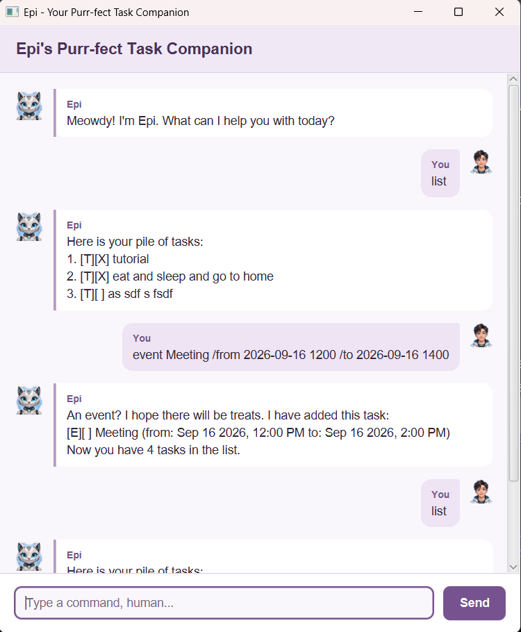

# Epi User Guide

**Epi** is your cat-themed task companion: keep track of todos, deadlines, and events by typing into a chat window. A little organisation, with a little attitude.



[Quick start](#quick-start) · [Command basics](#command-basics) · [Features](#features) · [Your data](#your-data) · [Troubleshooting](#troubleshooting)

## Quick start

1. Install **Java 25**. In a terminal, run `java -version` and check that it reports version 25.
2. Download **`epi.jar`** from **Assets** on the [latest release page](https://github.com/naymin-gif/ip/releases/latest). Choose the JAR, not a source-code ZIP or TAR archive.
3. Place the JAR in an empty folder you can write to. Open a terminal **in that same folder**, then run:

   ```bash
   java -jar "epi.jar"
   ```

4. Type `todo read book` into the command box, then press **Enter** or click **Send**. Try `list` to see your task.

The fat JAR includes JavaFX, so you do not need to install JavaFX or Gradle separately.

You can resize the window and scroll back through the conversation. A new installation starts with an empty task list; the screenshot shows example tasks.

> **Compatibility:** The current release has been tested on Windows x86-64 with Java 25. macOS/Linux smoke testing is pending. The bundled native libraries target x86-64; native ARM Java installations, including Apple Silicon, are not supported by this JAR.

### Alternative: run from source

With Java 25 installed, [download the current source](https://github.com/naymin-gif/ip/archive/refs/heads/master.zip) and extract it, or use your existing project checkout. Open a terminal in the project folder—the folder containing `gradlew`, `gradlew.bat`, and `build.gradle`—and use the command for your terminal:

**Git Bash / macOS / Linux:**

```bash
./gradlew run
```

**Windows PowerShell / Command Prompt:**

```powershell
.\gradlew.bat run
```

The first launch may take longer while dependencies download. If Gradle reports the wrong Java version, see [Troubleshooting](#troubleshooting). Running from source uses the same native-library configuration and does not add ARM support.

## Command basics

- In the formats below, replace uppercase placeholders such as `DESCRIPTION` and `NUMBER` with your own values. Do not type the placeholder names.
- Submit one command at a time. Command names and markers such as `/by` are case-insensitive; extra separating spaces are accepted.
- Dates use **`yyyy-MM-dd HHmm`**, with a 24-hour clock: `2026-10-20 1800` means 20 October 2026 at 6pm. Words such as `tomorrow` are not supported.
- Task descriptions must not be empty or contain line breaks or `|`. In dated tasks, reserve `/by`, `/from`, and `/to` for their command parameters.
- Use the **displayed task number**, even after searching or sorting. Run `list` if you are unsure.

## Features

### Add a todo: `todo`

For a task without a date or time.

**Format:** `todo DESCRIPTION`

```text
todo read book
```

Epi adds an incomplete task, shows it, and reports your new task count.

### Add a deadline: `deadline`

For a task that must be done by a particular date and time.

**Format:** `deadline DESCRIPTION /by DATE_TIME`

```text
deadline return book /by 2026-10-20 1800
```

The due time appears as `Oct 20 2026, 6:00 PM` in an English locale. Supply exactly one `/by` parameter.

### Add an event: `event`

For an activity with a start and end.

**Format:** `event DESCRIPTION /from START_DATE_TIME /to END_DATE_TIME`

```text
event project meeting /from 2026-10-18 1400 /to 2026-10-18 1600
```

Give both endpoints in full, with `/from` before `/to`. The end must be **later than** the start. Overnight and multi-day events are allowed.

### View all tasks: `list`

```text
list
```

Shows all tasks in their original order, including completed tasks. An empty list gets an explanatory message.

Read task labels as follows: `[T]` = todo, `[D]` = deadline, `[E]` = event; `[ ]` = incomplete and `[X]` = done. For example, `1. [T][X] read book` is completed task 1.

### Change completion status: `mark` and `unmark`

**Formats:** `mark NUMBER` and `unmark NUMBER`

```text
mark 1
unmark 1
```

The first command marks task 1 as done; the second makes it incomplete again. If it already has the requested status, Epi tells you and leaves it unchanged.

### Search descriptions: `find`

**Format:** `find TEXT`

```text
find BOO
```

Matches descriptions containing that text, ignoring case: this example finds both `read book` and `return Book`. Several words are treated as one phrase, not separate alternatives. Dates are not searched.

Results retain their **full-list task numbers**. No matches? Epi says so explicitly, for example:

```text
Meow! I couldn't find any tasks matching "movie".
```

### View tasks chronologically: `sort date`

```text
sort date
```

Shows the earliest dated tasks first: deadlines use their due time, and events use their start time. Undated todos appear last. Equal dates keep their original order, and completed tasks are included.

Sorting changes **only the view**, not the saved order or task numbers. If the first result is numbered `3`, use `mark 3` to complete it—not `mark 1`. A later `list` still shows the original order. Only `sort date` is supported.

### Delete a task: `delete`

**Format:** `delete NUMBER`

```text
delete 2
```

Removes task 2 and reports the remaining count. Later tasks are renumbered, so check `list` before your next deletion.

> **Careful:** Deletion is immediate. There is no undo command.

### Say goodbye: `bye`

```text
bye
```

In the GUI, Epi replies with a farewell; **close the window to exit**. In the console interface, `bye` ends the program. Both `bye` and `list` take no extra arguments.

## Your data

Successful additions, deletions, and status changes are saved automatically to `data/epi.txt`, under the folder from which you launch Epi. Tasks reload next time. Always launch from the same folder to use the same task list.

- Missing data folders/files are created on startup when permissions allow.
- To back up or transfer tasks, close Epi and copy `data/epi.txt`. Keep the backup separate from the working file.
- Use one Epi instance per data file. Avoid editing the file while Epi is running.
- Duplicate tasks are allowed as separate items. Editing, undo, natural dates, and a `help` command are not currently supported; use this guide for command help.

## Troubleshooting

Errors appear in a labelled **Epi - needs attention** card. Correct the problem and try again; rejected changes do not alter your saved tasks.

- **Unknown or incomplete command:** Check the formats above. Supply a description, keyword, or task number where required. Use each date marker exactly once.
- **Invalid task number:** Run `list` and use one existing positive whole number, such as `mark 1`.
- **Invalid date or event duration:** Check the date format and calendar date. `2026-02-30 1200` is invalid, and an event cannot end at or before its start.
- **Cannot load or save tasks:** Check that `data/epi.txt` is a file and that its folder is writable. Failed saves keep the previous task state. If the file was moved, deleted, or changed outside Epi, restore/check it and restart before making changes.
- **Damaged task file:** Epi warns you and shows any valid records it can recover, but blocks changes to protect the original file. Close Epi, back up the damaged file, then restore a known-good backup or repair the reported lines and restart. Do not delete your only copy.
- **Missing tasks after moving the app:** Check the folder you launched from. Move your backed-up `data/epi.txt` with the app.
- **Java/Gradle version error:** Ensure both `java -version` and `JAVA_HOME` refer to Java 25; setting IntelliJ's Gradle JVM alone does not change its terminal environment.
- **Unable to access the JAR:** Open the terminal in the JAR's folder and use its exact filename, including `.jar`.

---

For contributors: [source repository](https://github.com/naymin-gif/ip), [console test plan](https://github.com/naymin-gif/ip/blob/master/tests/test-plan.md), and [GUI test plan](https://github.com/naymin-gif/ip/blob/master/tests/gui-test-plan.md).
